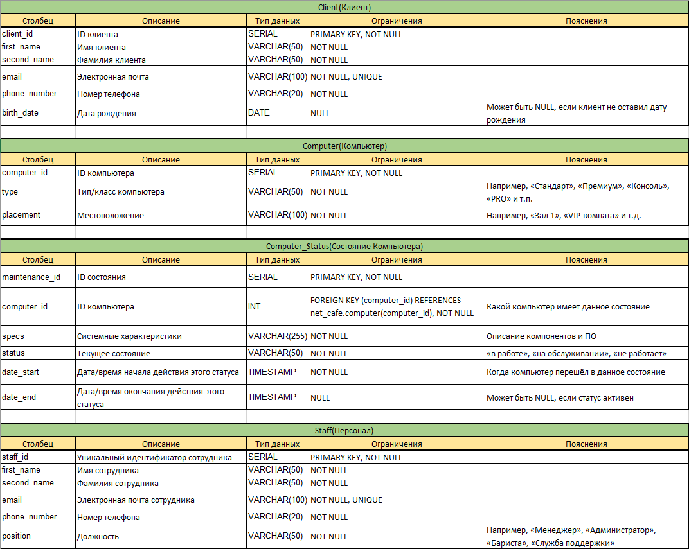
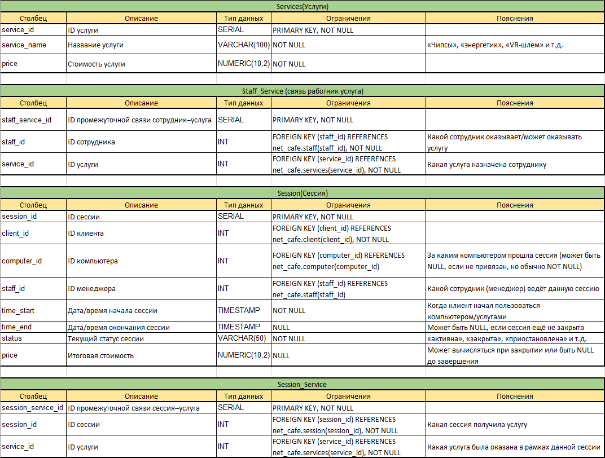

# Net Cafe Project

## О проекте

Система управления компьютерным клубом "Net Cafe" на PostgreSQL. Включает:

* **Физическую** и **логическую** модели данных.
* **DDL**-скрипты для создания схемы `net_cafe` и таблиц.
* **DML**-скрипты для наполнения тестовыми данными.
* **Представления** (VIEW) для быстрого доступа к актуальным статусам и сводке по менеджерам.
* **Функции** и **процедуры** на PL/pgSQL для автоматизации бизнес-логики.
* **Триггеры** для соблюдения целостности и правил назначения ролей.
* **Индексы** для ускорения ключевых запросов.
* **Набор аналитических запросов** с использованием JOIN, подзапросов и оконных функций.

Проект учитывает распределение ролей сотрудников (менеджеры, администраторы, компьютерные мастера, служба поддержки, бариста, уборщики) и особенности работы клуба: сессии, состояние компьютеров, услуги.

---

## Физическая модель




**Краткое описание таблиц:**

* **Client:** клиенты (контакты, дата рождения).
* **Computer/Computer\_Status:** компьютеры и история их состояний.
* **Staff/Staff\_Service:** сотрудники, их роли и назначенные услуги.
* **Services:** справочник услуг с ценами.
* **Session/Session\_Service:** сеансы клиентов, прикреплённые менеджеры и заказанные услуги.

---

## Сценарии использования

### Установка и запуск

1. Клонировать репозиторий и перейти в папку проекта.
2. В `psql` выполнить **DDL**:

   ```bash
   psql -d <db> -f ddl/create_tables.sql
   ```
3. Наполнить данными (**DML**):

   ```bash
   psql -d <db> -f dml/insert_data.sql
   ```
4. Создать **VIEW**:

   ```bash
   psql -d <db> -f sql/views.sql
   ```
5. Зарегистрировать **функции/процедуры**:

   ```bash
   psql -d <db> -f sql/functions_and_procedures.sql
   ```
6. Установить **триггеры**:

   ```bash
   psql -d <db> -f sql/triggers.sql
   ```
7. Создать **индексы**:

   ```bash
   psql -d <db> -f sql/indexes.sql
   ```
8. Запустить **аналитические запросы** для проверки:

   ```bash
   psql -d <db> -f sql/queries.sql
   ```

### Скрипты

| Этап                   | Файл                               | Описание                                                                                                                     |
| ---------------------- | ---------------------------------- | ---------------------------------------------------------------------------------------------------------------------------- |
| Создание схем и таблиц | `ddl/create_tables.sql`            | Таблицы в схеме `net_cafe`                                                                                                   |
| Наполнение данными     | `dml/insert_data.sql`              | Тестовые данные                                                                                                              |
| Представления          | `sql/views.sql`                    | `current_computer_status`, `manager_session_summary`                                                                         |
| Функции/процедуры      | `sql/functions_and_procedures.sql` | Функции: `get_client_total_spent`, `get_top_services`<br>Процедуры: `create_session_with_services`, `record_computer_status` |
| Триггеры               | `sql/triggers.sql`                 | Триггеры: проверка менеджера, закрытие статуса, контроль staff\_service                                                      |
| Индексы                | `sql/indexes.sql`                  | `idx_session_staff_time`, `idx_computer_status_latest`                                                                       |
| Аналитические запросы  | `sql/queries.sql`                  | Осмысленные SELECT-запросы                                                                                                   |

---

## Где можно использовать

* Управление и аналитика в компьютерных клубах и интернет-кафе
* Интеграция с CRM и системами бронирования
* Учебная платформа для изучения PostgreSQL, PL/pgSQL, триггеров и индексирования
